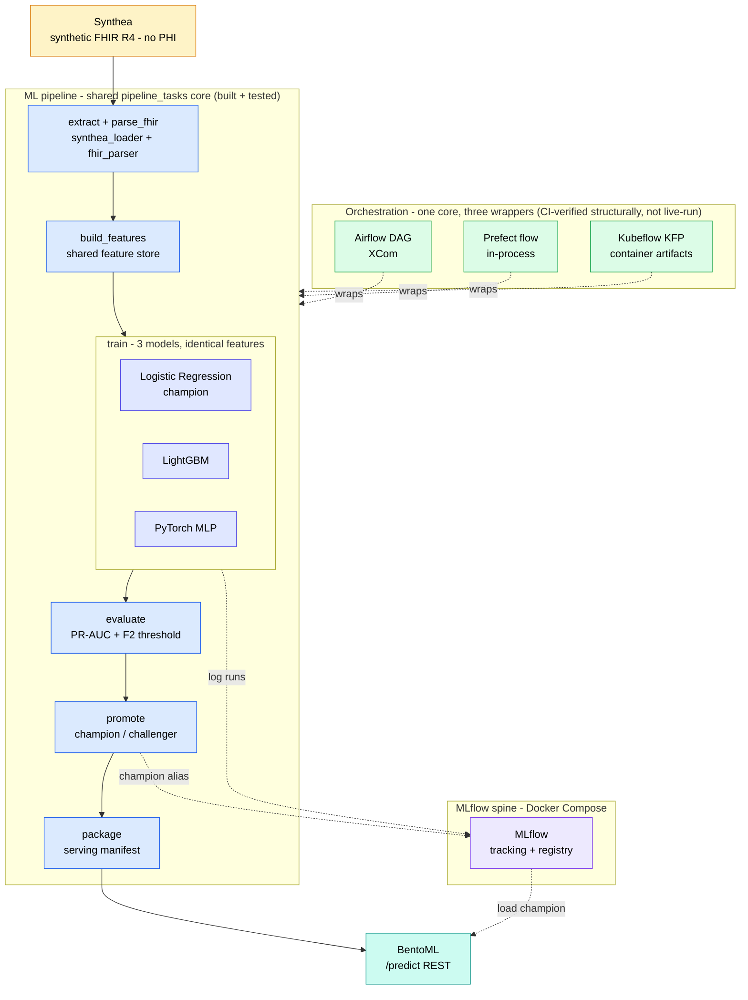

# ClinOps — Multi-Orchestrator Clinical MLOps Pipeline

> One orchestrator-agnostic ML pipeline, trained on synthetic FHIR R4 patient data, executed on **Airflow**, **Prefect**, and **Kubeflow** — with a written trade-off comparison.


---

## Author

**Alireza Minagar** — AI/ML Software Engineer

AWS Certified Machine Learning Specialist and full-stack AI/ML software engineer
(Python, FastAPI, AWS, MLOps) building production-style ML systems, with a focus on
healthcare ML.

[GitHub](https://github.com/aliminagar) ·
[LinkedIn](https://linkedin.com/in/alireza-minagar-ai) ·
[Portfolio](https://alirezaminagar-md.netlify.app) ·
[aminagar@gmail.com](mailto:aminagar@gmail.com)

---

## What this is

ClinOps is a portfolio MLOps project built around a single, **orchestrator-agnostic** machine-learning pipeline. The pipeline steps live as plain Python functions in one place ([`src/clinops/tasks/pipeline_tasks.py`](src/clinops/tasks/pipeline_tasks.py)) and are then _wrapped_ — never re-implemented — by three different orchestrators. The model is trained on **synthetic FHIR R4** patient data generated by [Synthea](https://github.com/synthetichealth/synthea), so no real patient data is ever involved. The goal: **one pipeline, wrapped by all three major orchestrators (Airflow, Prefect, Kubeflow) with a written trade-off comparison.** Status today: the ML pipeline (ETL → serving) is built and tested, and all three orchestrator wrappers (Airflow, Prefect, Kubeflow) are implemented with structural tests that **pass in CI**. The orchestrators have not yet been run end-to-end on live runtimes (a real Airflow stack / Prefect server / `kind` cluster) — structural ≠ live.

The model layer trains scikit-learn baselines (logistic regression + gradient boosting) and a PyTorch feed-forward challenger on the **same features**. MLflow tracks every run and hosts the model registry; champion/challenger promotion logic decides which model BentoML serves at a `/predict` REST endpoint. Both ML frameworks are load-bearing — the registry picks the winner.

## Architecture



## Tool roles

| Tool             | Role                                                      | Why it's here                                                                                                     |
| ---------------- | --------------------------------------------------------- | ----------------------------------------------------------------------------------------------------------------- |
| **MLflow**       | Experiment tracking + model registry                      | The spine — every run is logged here, and the registry is the single source of truth for which model is champion. |
| **Airflow**      | Primary scheduled batch pipeline (Docker Compose)         | The production-style, scheduled orchestrator; the reference implementation.                                       |
| **Prefect**      | Same pipeline re-implemented as flows                     | A modern Pythonic orchestrator; documented side-by-side comparison against Airflow.                               |
| **Kubeflow**     | KFP pipeline authored with the KFP SDK                    | Kubernetes-native orchestration; run once on a local `kind` cluster to prove portability.                         |
| **BentoML**      | Packages the champion model, serves REST `/predict`       | Turns the registry's champion into a deployable, versioned prediction service.                                    |
| **Synthea**      | Synthetic FHIR R4 data source                             | Realistic clinical data shape with **zero PHI** — no real patient data, ever.                                     |
| **scikit-learn** | Baseline models (logistic regression + gradient boosting) | Fast, interpretable baselines the challenger must beat.                                                           |
| **PyTorch**      | Feed-forward challenger                                   | Tests whether a neural net earns promotion over the baselines on the same features.                               |

## Repository layout

```
clinops/
├── README.md
├── CLAUDE.md
├── .gitignore
├── .env.example
├── pyproject.toml
├── requirements.txt
├── Makefile
├── docker-compose.yml          # mlflow + postgres + minio
├── .github/workflows/ci.yml
├── data/{raw,interim,processed}/
├── src/clinops/
│   ├── config.py
│   ├── etl/{synthea_loader.py, fhir_parser.py}
│   ├── features/build_features.py
│   ├── models/{sklearn_models.py, torch_model.py}
│   ├── training/{train.py, evaluate.py}
│   ├── registry/promote.py
│   ├── tasks/pipeline_tasks.py   # ← orchestrator-agnostic core
│   └── serving/bentoml_service.py
├── orchestration/
│   ├── airflow/dags/clinops_dag.py
│   ├── airflow/docker-compose.airflow.yml
│   ├── prefect/clinops_flow.py
│   └── kubeflow/{pipeline.py, kind-config.yaml}
├── tests/                       # 13 test modules: etl, features, models, torch,
│                                #   training, evaluate, split, mlflow, registry_promote,
│                                #   serving, + airflow/prefect/kubeflow structural tests

├── notebooks/exploration.ipynb
└── docs/{architecture.md, orchestrator-comparison.md}
```

## Quickstart

```bash
# 1. Install dependencies and dev tooling
make setup

# 2. Bring up the MLflow stack (MLflow + Postgres + MinIO)
docker compose up -d

# 3. Generate/load synthetic data and run the ETL
make etl

# 4. Train all models and log runs to MLflow
make train

# 5. Serve the champion model via BentoML /predict
make serve
```

> Status: the ML pipeline (ETL → serving) is built and tested, and all three orchestrators (Airflow/Prefect/Kubeflow) are implemented with structural tests that **pass in CI** (ruff + pytest green). They have not yet been run end-to-end on live runtimes (real Airflow stack / Prefect server / `kind` cluster). The 7-step pipeline path has no `NotImplementedError`; only the optional `run_pipeline()`/CLI convenience entry points remain stubs. See the Roadmap for per-stage status.

## Serving the champion (`/predict`)

The BentoML service loads the **champion from the MLflow registry by name**
(`clinops-readmission-classifier`, preferring a `champion` alias, else the latest
version) and reads its deployed **F2 screening threshold** from the run's logged
`operating_threshold` — nothing is hardcoded. The request is validated against the
model's own feature schema, so a train/serve skew is rejected up front.

```bash
# Build the bento (uses bentofile.yaml)
bentoml build

# Serve locally (champion resolved from MLflow at startup)
bentoml serve clinops.serving.bentoml_service:svc
```

Sample request — the body is the engineered feature row (all 12 model features):

```bash
curl -s http://localhost:3000/predict \
  -H 'Content-Type: application/json' \
  -d '{"request": {"features": {
        "age": 71, "bmi": 31.2, "bmi_missing": 0,
        "chronic_condition_count": 2, "cond_diabetes": 1, "cond_heart_failure": 0,
        "cond_hypertension": 1, "gender_female": 0, "gender_male": 1,
        "prior_encounter_count": 12, "prior_inpatient_count": 1, "systolic_bp": 140
      }}}'
# -> {"probability": 0.49, "threshold": 0.813, "readmission_flag": false, "model_version": "3"}
```

The endpoint returns the calibrated **probability** plus the **F2 screening
decision** (`readmission_flag = probability >= threshold`) and the served model
version — never just the flag. (Response values above are illustrative.)

## Orchestration — Airflow

The same `pipeline_tasks` core is **wrapped, never re-implemented**, by an Airflow
DAG ([`clinops_dag.py`](orchestration/airflow/dags/clinops_dag.py)) that runs the
seven steps in order — extract → parse_fhir → build_features → train → evaluate →
promote → package — as a linear, manual-trigger graph (`schedule=None`,
`catchup=False`, no retries).

```bash
# Bring up the Airflow stack (postgres + db init + webserver + scheduler)
make airflow-up
# equivalently:
docker compose -f orchestration/airflow/docker-compose.airflow.yml up -d

# UI at http://localhost:8080 (admin / admin). Trigger a run:
docker compose -f orchestration/airflow/docker-compose.airflow.yml \
  exec airflow-scheduler airflow dags trigger clinops_pipeline
```

DAG **structure** is validated by [`tests/test_airflow_dag.py`](tests/test_airflow_dag.py)
(it imports the DAG module and asserts on the in-memory DAG object — no metadata DB,
no live cluster). Airflow has no Windows-native wheel, so those tests `importorskip`
Airflow locally and run in CI, where they **pass**.

> Every step in the chain is implemented (`promote` selection/registration lives
> in [`registry/promote.py`](src/clinops/registry/promote.py)), so the DAG can run
> end to end. Its structural tests pass in CI; what remains is a validation run on a
> live Airflow cluster (still future).

## Orchestration — Prefect

The **same** `pipeline_tasks` core is **wrapped, never re-implemented**, by a
Prefect flow ([`clinops_flow.py`](orchestration/prefect/clinops_flow.py)) — the
Prefect-idiomatic expression of the identical seven-step graph (extract →
parse_fhir → build_features → train → evaluate → promote → package). Each step is
a `@task` wrapping one `pipeline_tasks` function; the `@flow` chains them in order,
passing each task's output to the next (sequential data passing encodes the linear
dependency graph the Airflow DAG declares with explicit edges).

```bash
# Run the flow locally, in-process (no server / deployment needed):
python orchestration/prefect/clinops_flow.py
# equivalently:
make prefect-run
```

Flow **structure** is validated by [`tests/test_prefect_flow.py`](tests/test_prefect_flow.py)
(imports the flow and asserts each task wraps a real `pipeline_tasks` callable in
the right order — it never runs the pipeline). The tests `importorskip` Prefect, so
they run wherever Prefect is installed; this pass does **not** stand up a Prefect
server.

> The flow wraps the same fully-implemented core as the Airflow DAG, so it can run
> end to end. Its structural tests pass in CI; what remains is a validation run on a
> live Prefect runtime (still future).

## Orchestration — Kubeflow

The **same** `pipeline_tasks` core is **wrapped, never re-implemented**, by a
Kubeflow Pipelines (KFP v2) definition
([`pipeline.py`](orchestration/kubeflow/pipeline.py)) — the KFP-idiomatic
expression of the identical seven-step graph (extract → parse_fhir →
build_features → train → evaluate → promote → package). Each step is a
`@dsl.component` wrapping one `pipeline_tasks` function; one `@dsl.pipeline` wires
them in order.

**How Kubeflow differs from Airflow/Prefect** (the crux of the comparison): KFP
components run as **containerized steps** on Kubernetes and pass data across
container boundaries as **parameters / file artifacts**, not in-process returns.
Each component is a hermetic function that imports `pipeline_tasks` *inside* the
container; `Path` returns are stringified (the core already accepts `str` paths),
and `task.output → next component` is what KFP turns into the cross-container
dependency graph.

```bash
# 1. Compile the pipeline to a KFP IR spec locally (no cluster needed):
python orchestration/kubeflow/pipeline.py   # -> clinops_pipeline.yaml

# 2. (Live run, not required here) Bring up a local kind cluster with the
#    bundled config, install KFP, then submit the compiled spec:
kind create cluster --config orchestration/kubeflow/kind-config.yaml
#    ...install Kubeflow Pipelines, then upload/run clinops_pipeline.yaml via the
#    KFP UI or `kfp run create`. A real run needs a container image with `clinops`
#    (and deps) installed — see the module docstring.
```

Pipeline **structure** is validated by
[`tests/test_kubeflow_pipeline.py`](tests/test_kubeflow_pipeline.py) (imports the
module, compiles it to a temp IR, and asserts each component wraps a real
`pipeline_tasks` callable in the right order — it never submits or runs the
pipeline). The tests `importorskip` kfp, so they run wherever kfp is installed;
this pass does **not** stand up a kind cluster.

> The pipeline wraps the same fully-implemented core as the Airflow DAG and
> compiles to a valid KFP IR. Its structural tests pass in CI; what remains is a
> validation run on a live Kubeflow/`kind` cluster (still future).

## Roadmap

| Component                                  | Status     | Milestone      |
| ------------------------------------------ | ---------- | -------------- |
| ETL (Synthea → FHIR parse)                 | ✅ Done    | Weekend-2 core |
| Feature engineering                        | ✅ Done    | Weekend-2 core |
| scikit-learn baselines (logreg + LightGBM) | ✅ Done    | Weekend-2 core |
| PyTorch challenger                         | ✅ Done    | Weekend-2 core |
| MLflow tracking + registry                 | ✅ Done    | Weekend-2 core |
| Champion/challenger promotion †            | ✅ Done    | Weekend-2 core |
| F2 threshold selection                     | ✅ Done    | Weekend-2 core |
| BentoML `/predict` serving                 | ✅ Done    | Weekend-2 core |
| CI (lint + pytest) ‡                       | ✅ CI-green | Weekend-2 core |
| Airflow DAG §                              | ✅ CI-green | Weekend-2 core |
| Prefect flow §                             | ✅ CI-green | Later addition |
| Kubeflow KFP pipeline §                    | ✅ CI-green | Later addition |

> **✅ CI-green** = structural tests pass in CI (imports, step wiring, ordering;
> KFP also compiles to IR). It does **not** mean an end-to-end run on a live
> Airflow stack / Prefect server / `kind` cluster — that is still future.

> † Promotion is centralized in
> [`registry/promote.py`](src/clinops/registry/promote.py) (selects the
> highest-CV-PR-AUC model, registers it, and points the `champion` alias at it —
> idempotent), and the `pipeline_tasks.promote` step is real and wired into the
> pipeline — verified by a real flavor switch from LightGBM to logistic regression.
> The full 7-step path (extract → … → package) has **no** `NotImplementedError`;
> the only remaining stubs are the optional `run_pipeline()` convenience entry point
> and the module `__main__` CLI, neither of which is on the DAG path.
>
> ‡ The CI workflow ([`.github/workflows/ci.yml`](.github/workflows/ci.yml)) (ruff +
> pytest) runs on every push and is **green**. On the Linux runner all three
> orchestrator structural test modules execute (airflow/prefect/kfp install there)
> and pass — they only skip locally on Windows, where these SDKs have no wheel.
>
> § Airflow, Prefect, and Kubeflow are implemented and their structural tests pass
> in CI — imports, step-to-`pipeline_tasks` wiring, and ordering (KFP also compiles
> to a KFP IR). This is structural validation only; none has been run end-to-end on
> a live runtime (Airflow stack / Prefect server / `kind` cluster) yet.

**ML pipeline (built):** ETL → features → models (sklearn + PyTorch) → MLflow registry → BentoML `/predict`, end to end on synthetic data. **Orchestrators (built + CI-green):** the same `pipeline_tasks` core is wrapped by an Airflow DAG, a Prefect flow, and a Kubeflow KFP pipeline — all implemented with structural tests that pass in CI, with the trade-off write-up in [`docs/orchestrator-comparison.md`](docs/orchestrator-comparison.md). **Next:** validate the three wrappers end-to-end on live runtimes (Airflow stack / Prefect server / `kind` cluster).

## Data

All data is **synthetic**, generated by [Synthea](https://github.com/synthetichealth/synthea) as FHIR R4 bundles. **No protected health information (PHI) and no real patient data are ever used, stored, or committed.** The `data/` directory is git-ignored except for `.gitkeep` placeholders.

## License

MIT — see badge above.

---

Built by **Alireza Minagar** · AI/ML Software Engineer ·
[GitHub](https://github.com/aliminagar) ·
[LinkedIn](https://linkedin.com/in/alireza-minagar-ai) ·
[Portfolio](https://alirezaminagar-md.netlify.app) ·
[aminagar@gmail.com](mailto:aminagar@gmail.com)
